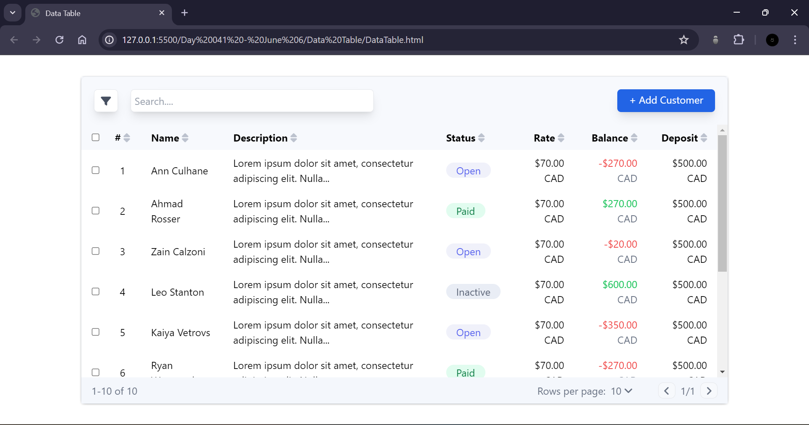

# DATA TABLE

## Resources

The design file for the login page can be found [here](https://www.figma.com/proto/kfTMtMFCg1hiXWJdgVaXEx/Data-Table-(Community)?node-id=1376-6447&m=dev&scaling=min-zoom&page-id=73%3A0&starting-point-node-id=1376%3A6447)

## Work Done

- Used HTML and Tailwind CSS to create a responsive data table page.
- Used the images and styles from the Figma design

## Output

