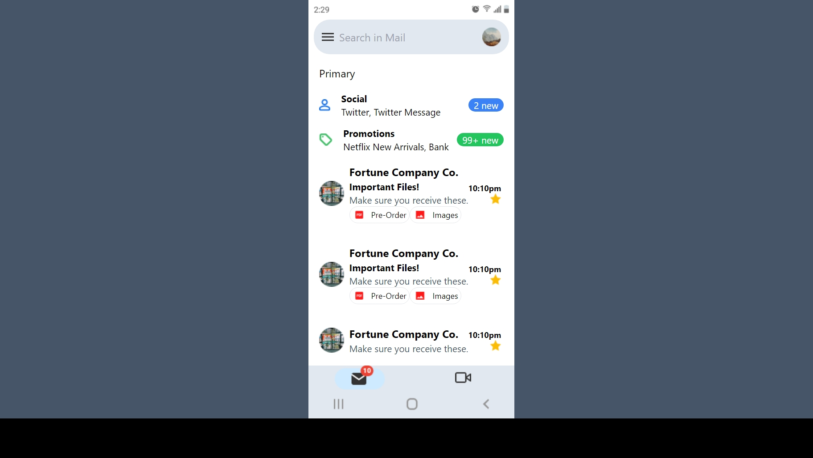
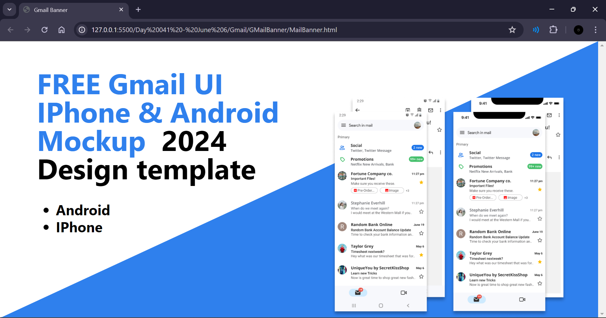

# GMAIL

## Resources

The design file for the login page can be found [here](https://www.figma.com/design/RuNyXuiA9h9KNgaJGDambR/Gmail-UI-Mobile-Design-Template-2024!-(Community)?node-id=1-286&m=dev)

## Work Done

- Used HTML and Tailwind CSS to create a duplicate of the Android Gmail page and Gmail banner.
- Used the images and styles from the Figma design.

## Output

- Android GMail Layout
    - The work done on this can be found [here](./AndroidGmail)

- GMail Banner
    - The work done on this can be found [here](./GMailBanner/)

