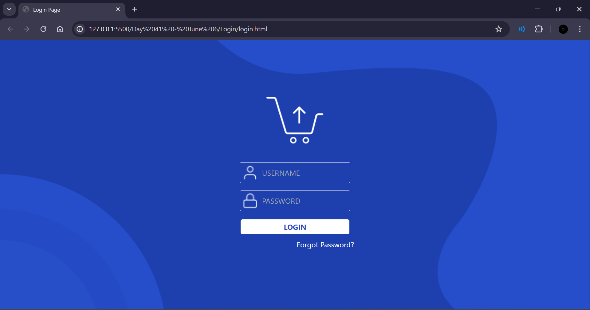

# LOGIN

## Resources

The design file for the login page can be found [here](https://www.figma.com/design/RIETxxn8ypeoZdxaq7RAxB/Login-Page-design-(Community)?node-id=0-1&t=Bdo2RpAoUMyQV8Ss-0)

## Work Done

- Used HTML and Tailwind CSS to create a responsive login page.
- Used the images and styles from the Figma design

## Output

