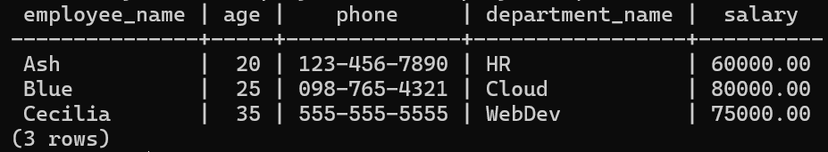

# PostgreSQL Docker

## Steps to Set Up PostgreSQL Using Docker

### 1. Pull the PostgreSQL Docker Image

```bash
docker pull postgres
```

### 2. Run a PostgreSQL Instance in Docker

```bash
docker run --name postgres-db -e POSTGRES_PASSWORD=mysecretpassword -d postgres
```

Replace `mysecretpassword` with your password

### 3. Create a Database Named `dbDocker`

First, access the running PostgreSQL container:

```bash
docker exec -it postgres-db psql -U postgres
```

Then, create the database:

```sql
CREATE DATABASE dbdocker;
\c dbdocker
```

### 4. Create the Tables with Proper Relationships

```sql
CREATE TABLE Department (
    department_id SERIAL PRIMARY KEY,
    department_name VARCHAR(255) NOT NULL
);

CREATE TABLE Employee (
    employee_id SERIAL PRIMARY KEY,
    employee_name VARCHAR(255) NOT NULL,
    age INT,
    phone VARCHAR(20),
    department_id INT,
    FOREIGN KEY (department_id) REFERENCES Department(department_id)
);

CREATE TABLE Salary (
    salary_id SERIAL PRIMARY KEY,
    employee_id INT,
    amount DECIMAL(10, 2),
    FOREIGN KEY (employee_id) REFERENCES Employee(employee_id)
);
```

### 5. Insert Data into the Tables

```sql
INSERT INTO Department (department_name) VALUES ('HR'), ('Cloud'), ('WebDev');

INSERT INTO Employee (employee_name, age, phone, department_id) VALUES
('Ash', 20, '123-456-7890', 1),
('Blue', 25, '098-765-4321', 2),
('Cecilia', 35, '555-555-5555', 3);

INSERT INTO Salary (employee_id, amount) VALUES
(1, 60000.00),
(2, 80000.00),
(3, 75000.00);
```

### 6. Log Off the PostgreSQL Instance

Exit from the `psql` prompt:

```sql
\q
```

Stop the Docker container:

```bash
docker stop postgres-db
```

### 7. Run the Instance Again

Start the Docker container:

```bash
docker start postgres-db
```

### 8. Execute a SELECT Query

Access the PostgreSQL container again:

```bash
docker exec -it postgres-db psql -U postgres -d dbdocker
```

Run the SELECT query:

```sql
SELECT 
    e.employee_name, 
    e.age, 
    e.phone, 
    d.department_name, 
    s.amount AS salary
FROM 
    Employee e
JOIN 
    Department d ON e.department_id = d.department_id
JOIN 
    Salary s ON e.employee_id = s.employee_id;
```

This will print the `employee_name`, `age`, `phone`, `department_name`, and `salary` as required.

### 9. Output

The output of the final select query is given below.

