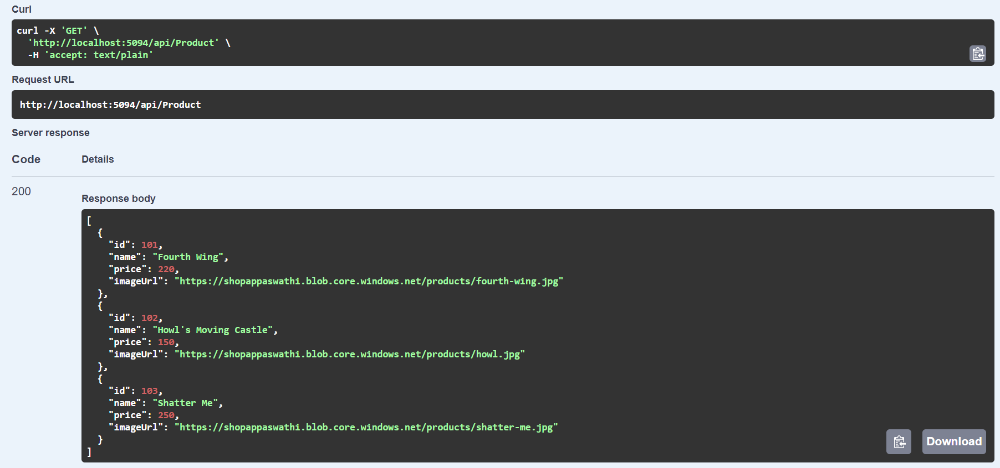
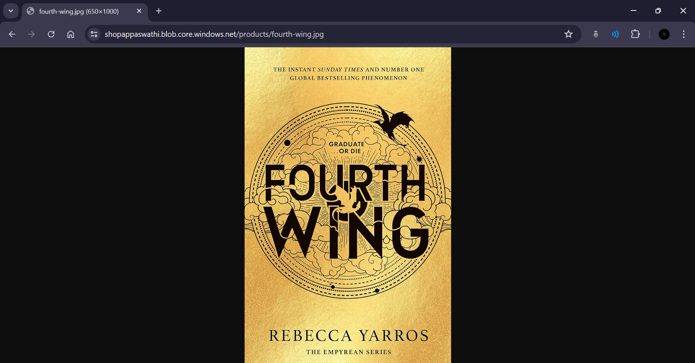

# Product Details Web API

## Overview

This Web API connects to a SQL Server instance running on a Virtual Machine to fetch product details. It retrieves the product's name, price, and picture. The picture images are stored in Azure Blob Storage, and the connection string for the SQL Server is securely stored and accessed from Azure Key Vault. The API supports only the GET method.


## Features

- **Fetch Product Details**: Retrieve product information including name, price, and a link to the product image.
- **Azure Blob Storage**: Product images are hosted on Azure Blob Storage.
- **Azure Key Vault Integration**: Securely fetch the SQL Server connection string from Azure Key Vault.
- **GET Method**: The API exposes 2 GET endpoints to retrieve all product details and a single product detail via ID.

## Getting Started

### Prerequisites

- **.NET 6.0 SDK or later**: Make sure you have .NET 6.0 SDK or a later version installed. You can download it from the [.NET official website](https://dotnet.microsoft.com/download).
- **Visual Studio or VS Code**: Recommended IDEs for developing and running the project.
- **Azure Subscription**: An Azure subscription for creating and managing Azure resources like Blob Storage and Key Vault.
- **SQL Server Instance**: A SQL Server instance hosted on an Azure Virtual Machine.


### API Endpoint

- **GET /api/Product**

  Fetches the list of products with their name, price, and image URL.

  **Response**:
  ```json
    [
        {
            "id": 101,
            "name": "Fourth Wing",
            "price": 220,
            "imageUrl": "https://shopappaswathi.blob.core.windows.net/products/fourth-wing.jpg"
        },
        {
            "id": 102,
            "name": "Howl's Moving Castle",
            "price": 150,
            "imageUrl": "https://shopappaswathi.blob.core.windows.net/products/howl.jpg"
        },
        {
            "id": 103,
            "name": "Shatter Me",
            "price": 250,
            "imageUrl": "https://shopappaswathi.blob.core.windows.net/products/shatter-me.jpg"
        }
    ]
  ```

### Output Screenshots



