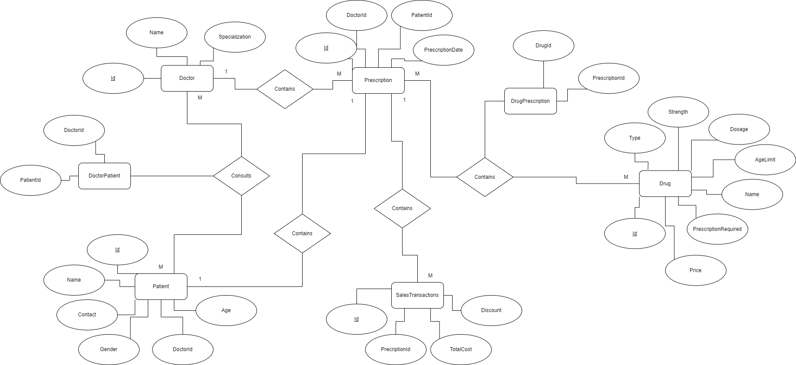
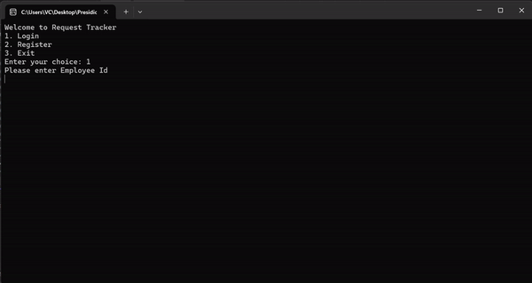

# DAY 21

## Topics Covered

- Pair Programming with ERD
- Code First Approach in Console App

## Work

**Questions**

1. Create an ERD for the assessment question(Pair Programming). The file for the same can be found [here](./PharmacyERD.png).

2. Complete the RequestTracker CodeFirstApproach. The repository for the same can be found [here](./RequestTrackerSolution)

**Output**

